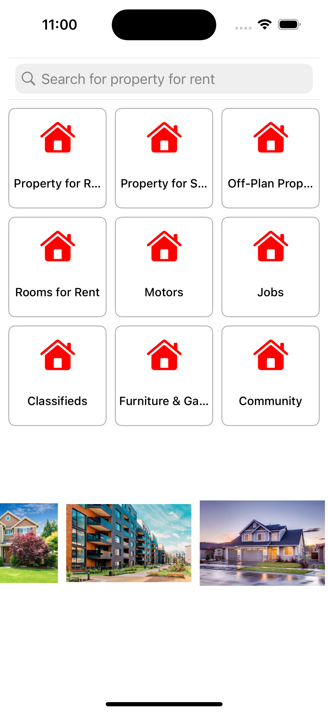

# Property Listing App

A simple iOS application built with `UICollectionView` that displays a vertical grid of property categories and a horizontally scrollable collection of popular property listings. The app demonstrates how to use `UICollectionView` programmatically with custom layouts and reusable views.

## Features
- **Search Bar**: A search bar for filtering properties.
- **Vertical Collection View**: Displays property categories like "Property for Rent," "Motors," "Jobs," etc., using a grid layout.
- **Horizontal Collection View**: Displays a scrollable list of popular residential properties.

## Screenshots
Here is a preview of the app:



## Setup Instructions

### Prerequisites
- Xcode 14 or above
- iOS Simulator or a physical iOS device running iOS 15.0 or later.

### How to Run
1. Clone the repository to your local machine:
    ```bash
    git clone https://github.com/your-username/property-listing-app.git
    ```
2. Open the project in Xcode:
    ```bash
    cd property-listing-app
    open PropertyListingApp.xcodeproj
    ```
3. Run the app in the iOS Simulator or on a physical device.

## Code Structure

### ViewController.swift
- Manages the **vertical collection view** and integrates the custom **horizontal collection view**.
- **Methods**:
  - `setupSearchBar`: Configures the search bar with placeholder text.
  - `setupVerticalCollectionView`: Creates and sets up the vertical grid for categories.
  - `setupHorizontalView`: Adds the custom horizontal view below the vertical grid.

### HorizontalCollectionView.swift
- A custom reusable view for the horizontal collection view.
- **Features**:
  - Scrollable horizontally.
  - Dynamically populates cells with images from the `images` array.
  - Implements `UICollectionViewDataSource` and `UICollectionViewDelegateFlowLayout`.


## Future Enhancements
- Add detailed search functionality.
- Allow filtering categories and popular properties.
- Enhance the UI with animations and dynamic data fetched from a backend service.

## Contributing
Contributions are welcome! Feel free to fork the repository, make changes, and submit a pull request.

## License
This project is licensed under the MIT License. See `LICENSE` for more details.

## Contact
For any queries or suggestions, feel free to reach out:
- **Email**: dharmamithrat@gmail.com

